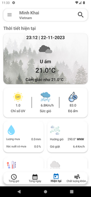
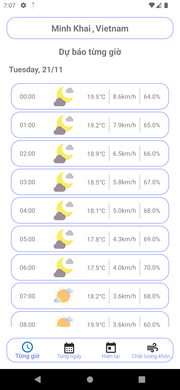
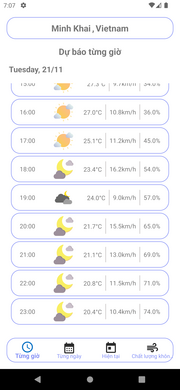
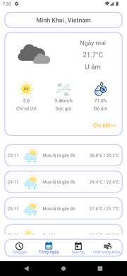
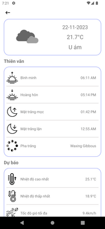
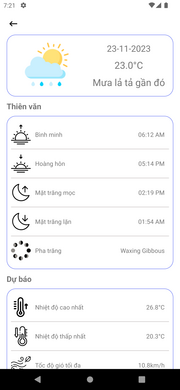
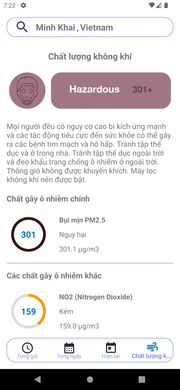

# Weather App

>Android application with functions: current weather information; Weather information by hour of the day; weather forecast for the next 14 days; information about the air quality index (AQI) at the present time; Weather information and forecasts for any location are searched.

**Note:** *The current version only supports Vietnamese.*

## Current weather information

>Weather information for the device's current location (or other found location) according to the following metrics:

- Temperature
- Feeling about temperature
- Status of weather
- UV index
- Wind speed
- Humidity
- Amount of rain
- Probability of rain
- Wind direction
- Maximum temperature
- Lowest temperature
- Vision
- Cloud cover

## Hourly weather information

>Hourly weather information for the device's current location (or other found location) with the same metrics as for current weather.

## Weather forecast for the next 14 days 

>Weather forecast for the next 14 days for the device's current location (or other found location) with the same metrics as the current weather.

## Air quality (AQI)

>Air quality information (AQI) for the device's current location (or other found location).

